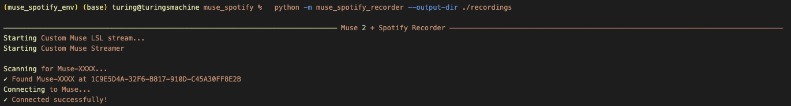
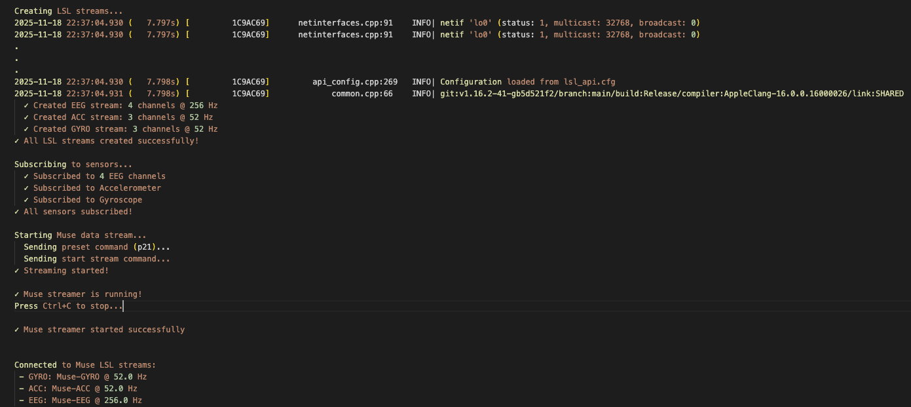
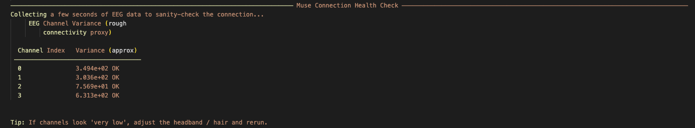
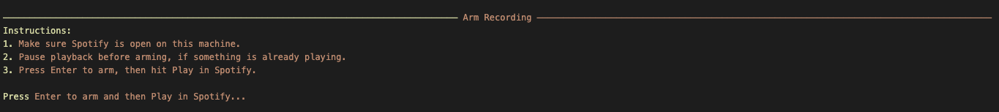
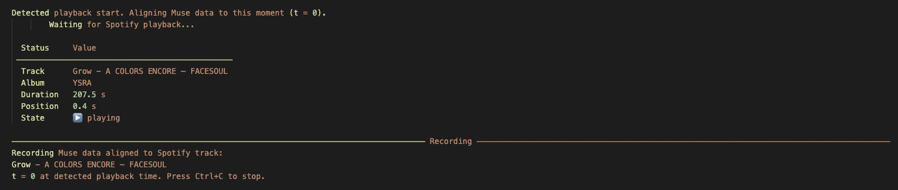
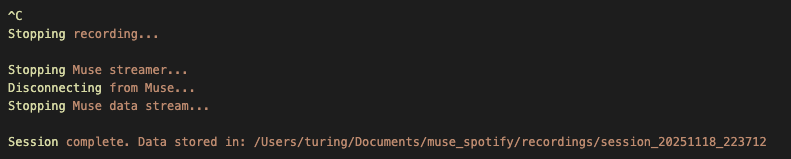

# 🧠🎵 TuneYourMuse: Muse 2 + Spotify Synchronized Recorder

**TuneYourMuse** is a Python tool designed to capture the neural context of your listening experience. It records synchronized biometrics (EEG, Accelerometer, Gyroscope) from the Muse 2 headband alongside precise Spotify playback metadata.

> **Note:** This repository features a **custom Bluetooth (Bleak) backend** built from scratch. It replaces the standard `muselsl` connection logic to provide significantly better stability on macOS and Linux.

-----

## 📌 Overview

This project is a modular, production-grade Python application that:

  * **Connects via Bleak:** Uses a custom asyncio implementation to manage the Muse 2 BLE connection and subscribe to characteristics.
  * **Streams to LSL:** Pushes EEG (256Hz), Accelerometer (52Hz), and Gyroscope (52Hz) data to the Lab Streaming Layer.
  * **Syncs with Spotify:** Authenticates via OAuth, monitors playback state, and detects the exact moment a track starts.
  * **Aligns Time:** Records all signals with timestamps aligned to the playback start event (`t = 0`).
  * **Exports Data:** Saves sensors to clean CSV files and generates a detailed `metadata.json`.

-----

## 📁 Project Structure

```text
muse_spotify/
├── .env                    # Configuration credentials
├── requirements.txt        # Dependencies
└── muse_spotify_recorder/
    ├── __main__.py         # Entry point
    ├── cli.py              # Typer CLI interface
    ├── config.py           # Env validation and constants
    ├── custom_muse_streamer.py # Main coordinator for BLE -> LSL (Custom implementation)
    ├── lsl_utils.py        # LSL stream discovery and recording loop
    ├── models.py           # Data classes (RecordingConfig, SpotifyTrackInfo)
    ├── muse_bluetooth.py   # Raw BleakClient connection handling
    ├── muse_constants.py   # UUIDs and GATT service definitions
    ├── muse_lsl_streamer.py # Manages LSL outlets
    ├── muse_parser.py      # Decodes raw BLE packets to calibrated units
    ├── recorder.py         # Orchestrates the full session
    └── spotify_client.py   # Spotify OAuth and polling logic
```

-----

## 🚀 Features

### ⚡️ Custom Muse Streaming (Bleak + PyLSL)

Standard libraries often struggle to maintain connections with the Muse 2. This repo includes a custom streaming engine that:

  * Handles BLE discovery and subscriptions manually via `bleak`.
  * Parses raw packets for EEG, Accelerometer, and Gyroscope.
  * Automatically sends "Keep Alive" commands to prevent disconnects.
  * **Sensors Supported:** EEG (TP9, AF7, AF8, TP10), Accelerometer (X, Y, Z), Gyroscope (X, Y, Z).
    * *Note: PPG is disabled as it is not supported on some muse models. Feel free to add your own integration if needed for your headset and submit a PR!*

### 🎧 Spotify Synchronization

  * Polls the Spotify API to detect when `is_playing` transitions to `True`.
  * Captures rich track metadata (Track ID, Artist, Album, Duration).
  * Aligns the recording so `0.0` in the CSV matches the exact start of the song.

### 💾 Robust Data Recording

  * Writes separate CSVs: `eeg_samples.csv`, `acc_samples.csv`, `gyro_samples.csv`.
  * CSV Header format: `sample_index, lsl_timestamp, time_since_play_sec, [channel_data...]`.
  * Includes a "Pre-roll" buffer to capture data seconds *before* you hit play.

-----

## 🧩 Requirements & Installation

1.  **Clone the repo:**

    ```bash
    git clone https://github.com/crsalas/TuneYourMuse.git
    cd TuneYourMuse
    ```

2.  **Create a virtual environment:**

    ```bash
    python3 -m venv .venv
    source .venv/bin/activate
    ```

3.  **Install dependencies:**

    ```bash
    pip install -r requirements.txt
    ```

-----

## ⚙️ Configuration (.env)

You must create a `.env` file in the root directory.

**1. Spotify Credentials:**
Create an app at the Spotify Developer Dashboard and set the Redirect URI to `http://127.0.0.1:8888/callback` (or similar port).

**2. Muse Device ID:**
You need both the device name and MAC address of your Muse headband.

**Environment Variables Explained:**

- `MUSE_NAME`: The Bluetooth name of your Muse device (e.g., `Muse-A1B2`, `Muse-DC0F`)
  - Used for device discovery during BLE scanning
  - Find this printed on the Muse headband itself or in the Muse mobile app

- `DEVICE_MAC_ADDRESS`: The unique Bluetooth MAC address of your device
  - Required for stable connection
  - Format varies by platform (see instructions below)

- `RECORDINGS_ROOT_PATH`: You also must specify the root path to your recordings.
  - This tells the analysis notebook where to look for your dataset
  - Format varies by platform

**Finding Your Muse MAC Address:**

**macOS:**
1. Open System Settings → Bluetooth
2. Find your Muse device in the list (ensure it's powered on)
3. Right-click on the Muse device and select "More Info" or use Bluetooth Explorer
4. Note the device address (format: `XX:XX:XX:XX:XX:XX`)

**Linux:**
```bash
# Scan for nearby Bluetooth devices
bluetoothctl
> scan on
# Look for "Muse-XXXX" and note the MAC address
> scan off
> exit
```

**Alternative (any platform):**
- Use the Muse mobile app - the MAC address is often shown in device settings
- Use a BLE scanner app:
  - **iOS/macOS**: LightBlue Explorer (App Store)
  - **Android**: nRF Connect (Google Play)
  - **Cross-platform**: Web Bluetooth Scanner

**Create a file named `.env` with the following:**

```ini
# Spotify API
SPOTIPY_CLIENT_ID="your_client_id_here"
SPOTIPY_CLIENT_SECRET="your_client_secret_here"
SPOTIPY_REDIRECT_URI="http://127.0.0.1:8888/callback"

# Muse Device
MUSE_NAME="Muse-XXXX"  # Replace XXXX with your device's 4-character ID
DEVICE_MAC_ADDRESS="XX:XX:XX:XX:XX:XX"  # Your Muse's Bluetooth MAC address

# Recordings Root
RECORDINGS_ROOT_PATH="/Users/YOUR_PROJECT_PATH/muse_spotify/recordings"
```

-----

## 🧪 Running a Session

Ensure your Muse 2 is powered on and **not** connected to your phone or other devices.

Run the recorder:

```bash
python -m muse_spotify_recorder --output-dir ./recordings
``` 


**The Workflow:**

1.  The script initializes the custom BLE streamer and waits for LSL streams.



2.  It performs a basic connection health check (signal variance).


3.  It authenticates with Spotify.


4.  **Arming:** You will be prompted to press **Enter** to arm the recorder.


5.  **Action:** Once armed, press **Play** on your Spotify app.

6.  **Recording:** The script detects playback and begins writing data to disk immediately.



7.  Press `Ctrl+C` to stop the session.



### Options

| Option | Description |
| :--- | :--- |
| `--output-dir` | Directory where session folders are created. |
| `--pre-roll-sec` | Seconds of data to keep *before* the detected play event (default: 0.0). |

-----

## 📂 Output Format

Data is saved in `recordings/session_<TIMESTAMP>/`.

**metadata.json:**
Contains synchronization details:

```json
{
  "session_id": "20251118_223712",
  "muse": {
    "name": "Custom Muse Streamer (Muse-XXXX)",
    "address": "1C9E5D4A-32F6-B817-910D-C45A30FF8E2B",
    "implementation": "bleak + pylsl (custom)"
  },
  "spotify": {
    "track_id": "2ZeQp8pc5sKyjLPBhn3DZj",
    "track_name": "Grow - A COLORS ENCORE",
    "artist_name": "FACESOUL",
    "album_name": "YSRA",
    "duration_ms": 207498,
    "started_at_unix": 1763356010.433811,
    "started_at_lsl": 1808083.178836083,
    "playback_position_ms": 490
  },
  "recording_config": {
    "output_dir": "/path/to/recordings/session_20251118_223712",
    "pre_roll_sec": 0.0,
    "post_roll_sec": 0.0,
    "poll_interval_sec": 0.25
  },
  "streams": ["EEG", "ACC", "GYRO"]
}
```

**CSV Files:**

  * **eeg\_samples.csv**: 12-bit raw values converted to microvolts (µV).
  * **acc\_samples.csv**: Converted to g (gravitational acceleration).
  * **gyro\_samples.csv**: Converted to degrees/second.

-----

## 📊 Next Steps

### Data Analysis

Want to understand what all this brain data means? Check out our comprehensive analysis guide:

📊 **[EEG Data Analysis Guide](exploration/README.md)** - Learn how to interpret your recordings:
- **Raw EEG Visualization**: Signal quality assessment and artifact detection
- **Power Spectral Density (PSD)**: Frequency domain analysis of brain rhythms
- **Time-Frequency Spectrograms**: Dynamic visualization of neural oscillations
- **Band Power Tracking**: Monitor alpha, beta, theta waves over time
- **Strange Attractor Analysis**: Chaos theory and nonlinear dynamics visualization
- **Neuroscience Interpretation**: Understand what each plot reveals about cognition and emotion

### Privacy & Sharing

Planning to share your analysis or visualizations? We're building privacy-first tools:

🔒 **Privacy-Safe Sharing** *(Coming Soon)*:
- **Privacy-safe plotting template**: Generate publication-ready plots without exposing personal metadata
- **Automated metadata stripping**: Remove Spotify account info and device identifiers before sharing
- **Privacy guidelines**: Best practices for sharing neuroscience data responsibly

📝 See our **[Privacy Policy](docs/PRIVACY.md)** *(Coming Soon)* for our stance on data ownership and sharing.

-----

## 🛠 Troubleshooting

  * **"Muse not found"**:
    - Ensure `MUSE_NAME` and `DEVICE_MAC_ADDRESS` in `.env` match your device exactly
    - Verify the device is powered on (LED should be blinking or solid)
    - Ensure the Muse is NOT connected to your phone or another device
    - Try power cycling the Muse (turn it off and on)

  * **"Connection failed"**:
    The custom streamer sends keep-alive commands, but BLE interference or distance can cause drops. Try:
    - Moving closer to your computer (within 3-5 meters / 10-15 feet)
    - Reducing obstacles between Muse and computer (walls, metal objects)
    - Closing other Bluetooth-intensive applications
    - Ensuring no other devices are trying to connect to the Muse
    - Restarting Bluetooth on your computer

  * **"Poor signal quality"** (low variance in health check):
    - Adjust the headband for better electrode contact
    - Dampen the electrodes slightly if hair is dry
    - Move hair away from electrode contact points
    - Ensure the headband is snug but comfortable

  * **Spotify Auth**:
    - If the browser doesn't open automatically, check your terminal for a URL to click
    - Ensure your Spotify app is installed and logged in
    - Verify the redirect URI in your Spotify Developer Dashboard matches `.env`